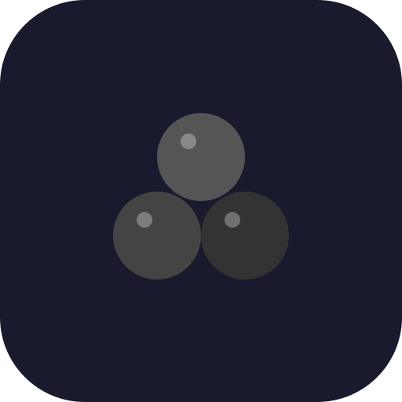
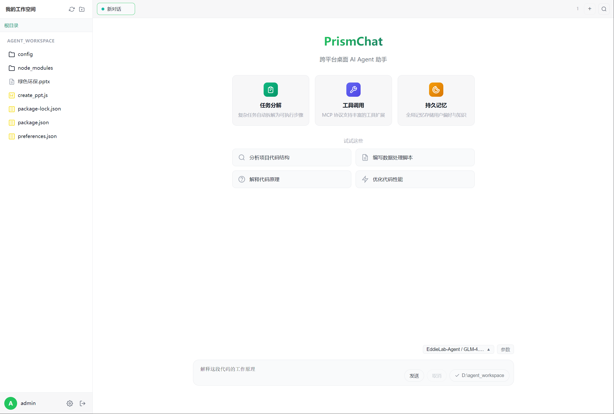
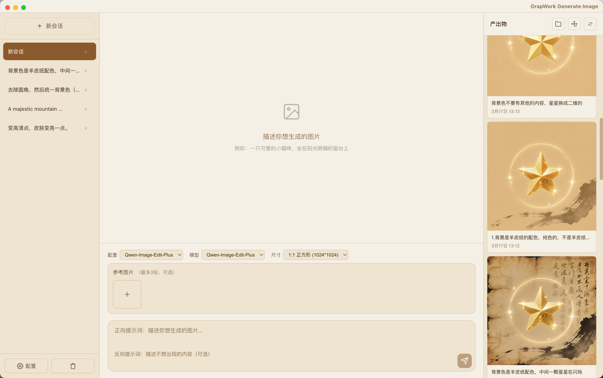
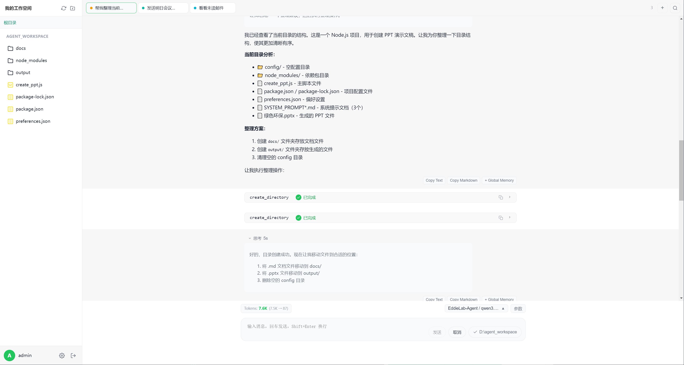
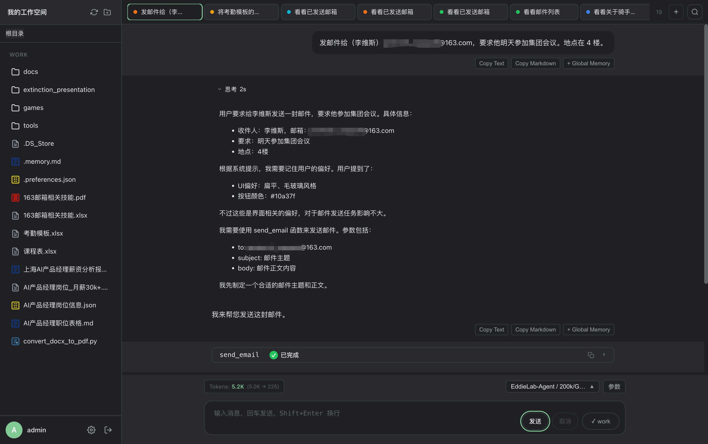
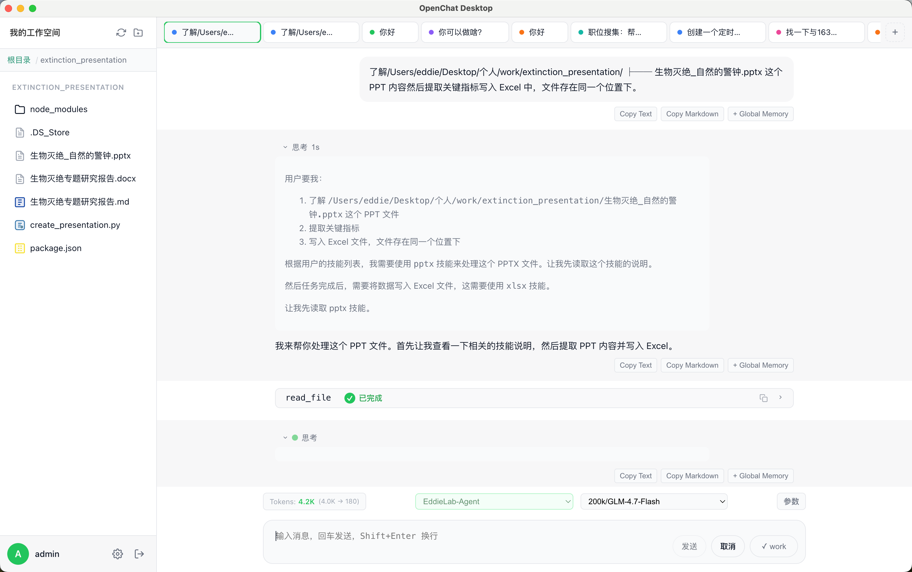
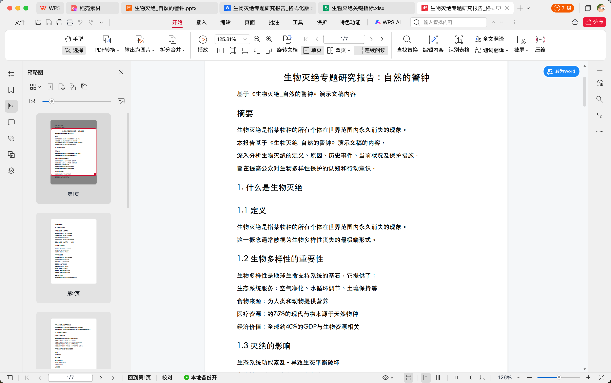
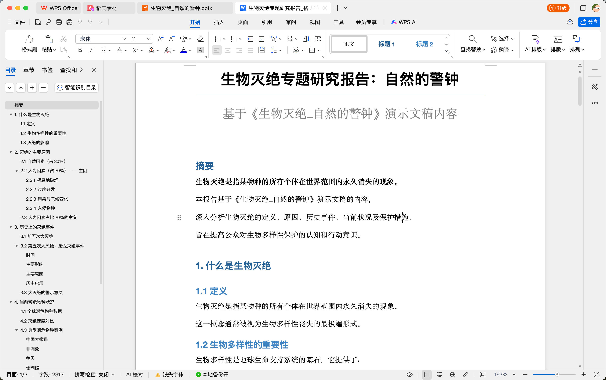
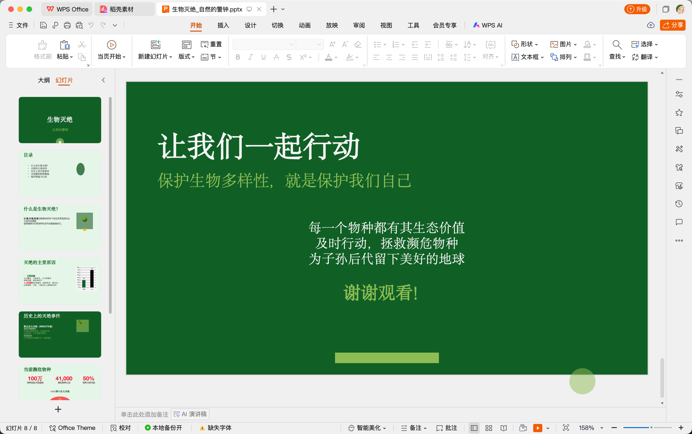

<div align="center">



# GrapWork

**A Cross-Platform Desktop AI Agent Assistant**

[](https://www.electronjs.org/)
[](https://vuejs.org/)
[](https://www.typescriptlang.org/)
[](LICENSE)

[English](#english) | [简体中文](#简体中文)

</div>

---

<a name="english"></a>

## English

### Introduction

**GrapWork** is a powerful cross-platform desktop AI Agent assistant that supports any OpenAI-compatible LLM API and provides a rich set of features for AI-powered productivity.

### Features

#### Core Features

- **Multi-LLM Support** - Compatible with any OpenAI-compatible API (OpenAI, Claude, DeepSeek, Qwen, etc.)
- **Multi-Tab Chat** - Manage multiple conversations with tabbed interface and search functionality
- **Streaming Response** - Real-time streaming output with support for multiple reasoning formats
- **Markdown Rendering** - Full markdown support with syntax highlighting and Mermaid diagrams
- **Copy Options** - Copy AI responses as plain text or formatted Markdown with one click

#### Advanced Features

- **Global Memory** - Persistent knowledge storage with smart keyword-based context injection
- **Assistant System** - Custom AI assistants with personalized system prompts
- **MCP Support** - Model Context Protocol integration for extensible tool/function calling (STDIO/SSE transports)
- **Skills System** - Domain knowledge packages that can be injected into AI context
- **Image Generator** - Multi-provider image generation (Zhipu GLM-Image, Qwen-Image, Qwen-Image-Edit)
- **Workspace View** - Built-in file browser and management capabilities
- **Cloud Sync** - Self-hosted sync server for cross-device configuration backup

### Tech Stack

| Category | Technology |
|----------|------------|
| Framework | Electron 28 + Vue 3.5 |
| Language | TypeScript 5.9 |
| Build | Vite 7 + esbuild |
| Styling | CSS3 (No framework) |
| Markdown | markdown-it + highlight.js + mermaid |
| Package | electron-builder |

### Installation

#### Prerequisites

- Node.js >= 18
- npm >= 9

#### Download Release

Download the latest release from [Releases](https://github.com/your-username/grapwork/releases) page:

- **macOS**: `.dmg` or `.zip`
- **Windows**: `.exe` (NSIS installer) or `.zip`
- **Linux**: `.AppImage` or `.deb`

##### macOS Installation Notes

Since the app is not notarized by Apple, you may encounter a "file is damaged" warning on first launch. Use one of the following methods to resolve:

**Method 1: System Settings**
1. Right-click the app and select "Open"
2. Click "Open" in the dialog
3. Or go to**System Settings → Privacy & Security** → Click "Open Anyway"

**Method 2: Terminal Command**
```bash
sudo xattr -cr /Applications/GrapWork.app
```

#### Build from Source

```bash
# Clone the repository
git clone https://github.com/your-username/grapwork.git
cd grapwork

# Install dependencies
cd frontend
npm install

# Development mode
npm run electron:dev

# Production build
npm run electron:build        # Build for current platform
npm run electron:build:mac    # Build for macOS only
npm run electron:build:win    # Build for Windows only
npm run electron:build:all    # Build for all platforms
```

### Configuration

#### API Configuration

Navigate to Settings (gear icon) > LLM Config to add your API:

| Field | Description | Example |
|-------|-------------|---------|
| API URL | Base URL of the API | `https://api.openai.com/v1` |
| API Key | Bearer token | `sk-xxx` |
| Model | Model name | `gpt-4o-mini` |
| Name | Display name | `My GPT-4` |

#### Chat Parameters

Per-chat OpenAI-compatible parameters:

| Parameter | Range | Default |
|-----------|-------|---------|
| temperature | 0 - 2 | 1 |
| top_p | 0 - 1 | 1 |
| max_tokens | 0+ | 0 (unlimited) |
| presence_penalty | -2.0 - 2.0 | 0 |
| frequency_penalty | -2.0 - 2.0 | 0 |
| seed | integer | - |

### Screenshots

| Main Interface | Generate Image |
|:--------------:|:--------------:|
|  |  |

| File Organization | Send Email |
|:-----------------:|:----------:|
|  |  |

### Use Cases

| Generate Excel | Generate PDF |
|:--------------:|:------------:|
|  |  |

| Generate Word | Generate PPT |
|:-------------:|:------------:|
|  |  |

### Development

#### Project Structure

```
grapwork/
├── frontend/
│   ├── electron/           # Electron main process
│   │   ├── main.ts         # IPC handlers, MCP client
│   │   └── preload.ts      # Context bridge
│   ├── src/
│   │   ├── components/     # Vue components
│   │   ├── composables/    # Vue composables
│   │   ├── services/       # Storage service
│   │   ├── types/          # TypeScript types
│   │   └── router/         # Vue Router
│   ├── build/              # App icons
│   └── electron-builder.json
├── server/                 # Optional Fastify server
├── CLAUDE.md               # Developer guide
└── README.md
```

#### NPM Scripts

```bash
npm run electron:dev          # Start dev server with hot reload
npm run build:renderer        # Build Vue app only
npm run build:electron        # Build Electron processes only
npm run build:electron:watch  # Watch mode for Electron build
npm run electron:build        # Full production build
npm run generate-icons        # Generate app icons
```

#### Documentation

| Document | Description |
|----------|-------------|
| [CLAUDE.md](CLAUDE.md) | Developer guide for Claude Code |
| [frontend/docs/SYNC_API_SPEC.md](frontend/docs/SYNC_API_SPEC.md) | Cloud Sync API specification |

### Important Notes

1. **API Key Security** - Never commit your API keys to version control
2. **First Launch** - The app will check for required dependencies (node, npx, uvx, uv)
3. **MCP Commands** - Shell commands require user approval for safety
4. **Storage Location**:
   - macOS: `~/Library/Application Support/mirrorgrap-work/`
   - Windows: `%APPDATA%/mirrorgrap-work/`
   - Linux: `~/.config/mirrorgrap-work/`

### Contributing

Contributions are welcome! Please feel free to submit a Pull Request.

1. Fork the repository
2. Create your feature branch (`git checkout -b feature/AmazingFeature`)
3. Commit your changes (`git commit -m 'Add some AmazingFeature'`)
4. Push to the branch (`git push origin feature/AmazingFeature`)
5. Open a Pull Request

### License

This project is licensed under the MIT License - see the [LICENSE](LICENSE) file for details.

---

<a name="简体中文"></a>

## 简体中文

### 简介

**GrapWork** 是一款跨平台桌面 AI Agent 助手。支持任意兼容 OpenAI 格式的 LLM API，提供丰富的 AI 生产力功能。

### 功能特性

#### 核心功能

- **多模型支持** - 兼容任意 OpenAI 格式 API（OpenAI、Claude、DeepSeek、通义千问等）
- **多标签对话** - 标签式会话管理，支持搜索功能
- **流式响应** - 实时流式输出，支持多种推理格式（DeepSeek、Qwen）
- **Markdown 渲染** - 完整 Markdown 支持，代码高亮，Mermaid 图表
- **复制选项** - 一键复制 AI 回复内容，支持纯文本或 Markdown 格式

#### 高级功能

- **全局记忆** - 持久化知识存储，智能关键词匹配自动注入上下文
- **助理系统** - 自定义 AI 助理，个性化系统提示词
- **MCP 支持** - Model Context Protocol 集成，支持 STDIO/SSE 传输协议
- **技能系统** - 领域知识包，可注入 AI 上下文
- **图片生成** - 多提供商图片生成（智谱 GLM-Image、通义万相）
- **工作区** - 内置文件浏览器和管理功能
- **云同步** - 自建同步服务器，跨设备配置备份

### 技术栈

| 类别 | 技术 |
|------|------|
| 框架 | Electron 28 + Vue 3.5 |
| 语言 | TypeScript 5.9 |
| 构建 | Vite 7 + esbuild |
| 样式 | CSS3 |
| Markdown | markdown-it + highlight.js + mermaid |
| 打包 | electron-builder |

### 安装

#### 系统要求

- Node.js >= 18
- npm >= 9

#### 下载安装包

从 [Releases](https://github.com/your-username/grapwork/releases) 页面下载最新版本：

- **macOS**: `.dmg` 或 `.zip`
- **Windows**: `.exe` (NSIS 安装包) 或 `.zip`
- **Linux**: `.AppImage` 或 `.deb`

##### macOS 安装说明

由于应用未经Apple 公证，首次打开可能会提示"文件已损坏"。请使用以下方法解决：

**方法一：系统设置**
1. 右键点击应用，选择"打开"
2. 在弹出对话框中点击"打开"
3. 或前往**系统设置 → 隐私与安全性** → 点击"仍要打开"

**方法二：终端命令**
```bash
sudo xattr -cr /Applications/GrapWork.app
```

#### 从源码构建

```bash
# 克隆仓库
git clone https://github.com/your-username/grapwork.git
cd grapwork

# 安装依赖
cd frontend
npm install

# 开发模式
npm run electron:dev

# 生产构建
npm run electron:build        # 构建当前平台
npm run electron:build:mac    # 仅构建 macOS
npm run electron:build:win    # 仅构建 Windows
npm run electron:build:all    # 构建所有平台
```

### 配置说明

#### API 配置

进入设置（齿轮图标）> LLM 配置，添加您的 API：

| 字段 | 说明 | 示例 |
|------|------|------|
| API URL | API 基础地址 | `https://api.openai.com/v1` |
| API Key | Bearer 令牌 | `sk-xxx` |
| Model | 模型名称 | `gpt-4o-mini` |
| Name | 显示名称 | `我的 GPT-4` |

#### 对话参数

每个对话可独立配置 OpenAI 兼容参数：

| 参数 | 范围 | 默认值 |
|------|------|--------|
| temperature | 0 - 2 | 1 |
| top_p | 0 - 1 | 1 |
| max_tokens | 0+ | 0 (无限制) |
| presence_penalty | -2.0 - 2.0 | 0 |
| frequency_penalty | -2.0 - 2.0 | 0 |
| seed | 整数 | - |

### 截图展示

| 主界面 | 图片生成 |
|:------:|:--------:|
|  |  |

| 文件整理 | 发送邮件 |
|:--------:|:--------:|
|  |  |

### 使用案例

| 生成 Excel | 生成 PDF |
|:----------:|:--------:|
|  |  |

| 生成 Word | 生成 PPT |
|:---------:|:--------:|
|  |  |

### 开发指南

#### 项目结构

```
grapwork/
├── frontend/
│   ├── electron/           # Electron 主进程
│   │   ├── main.ts         # IPC 处理、MCP 客户端
│   │   └── preload.ts      # 上下文桥接
│   ├── src/
│   │   ├── components/     # Vue 组件
│   │   ├── composables/    # Vue 组合式函数
│   │   ├── services/       # 存储服务
│   │   ├── types/          # TypeScript 类型
│   │   └── router/         # Vue Router
│   ├── build/              # 应用图标
│   └── electron-builder.json
├── server/                 # 可选 Fastify 服务器
├── CLAUDE.md               # 开发者指南
└── README.md
```

#### NPM 脚本

```bash
npm run electron:dev          # 启动开发服务器（热重载）
npm run build:renderer        # 仅构建 Vue 应用
npm run build:electron        # 仅构建 Electron 进程
npm run build:electron:watch  # Electron 构建监听模式
npm run electron:build        # 完整生产构建
npm run generate-icons        # 生成应用图标
```

#### 相关文档

| 文档 | 说明 |
|------|------|
| [CLAUDE.md](CLAUDE.md) | 开发者指南 |
| [SYNC_API_SPEC.md](frontend/docs/SYNC_API_SPEC.md) | 云同步接口规范 |

### 注意事项

1. **API Key 安全** - 切勿将 API 密钥提交到版本控制
2. **首次启动** - 应用会检查必要依赖（node、npx、uvx、uv）
3. **MCP 命令** - Shell 命令需要用户确认以确保安全
4. **数据存储位置**：
   - macOS: `~/Library/Application Support/mirrorgrap-work/`
   - Windows: `%APPDATA%/mirrorgrap-work/`
   - Linux: `~/.config/mirrorgrap-work/`

### 贡献指南

欢迎贡献代码！请随时提交 Pull Request。

1. Fork 本仓库
2. 创建功能分支 (`git checkout -b feature/AmazingFeature`)
3. 提交更改 (`git commit -m 'Add some AmazingFeature'`)
4. 推送到分支 (`git push origin feature/AmazingFeature`)
5. 打开 Pull Request

### 许可证

本项目采用 MIT 许可证 - 详情请查看 [LICENSE](LICENSE) 文件。

---

<div align="center">

**Made with love by baozebing**

[Report Bug](https://github.com/eddie-292/grapwork/issues) | [Request Feature](https://github.com/eddie-292/grapwork/issues)

</div>
